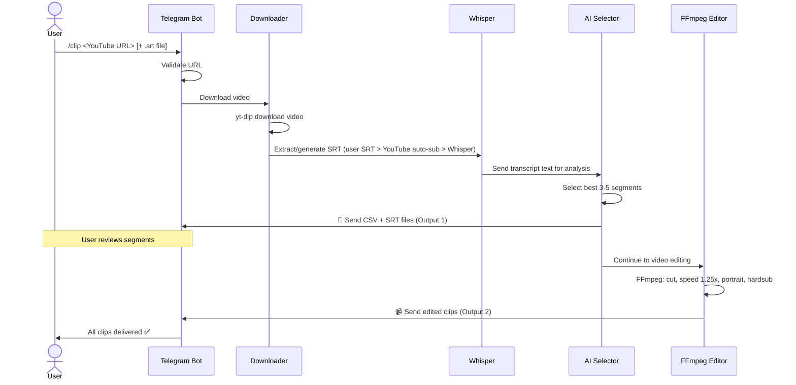
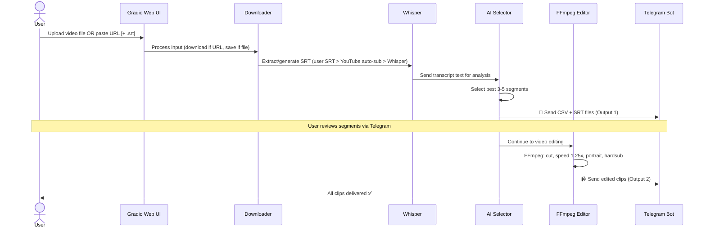
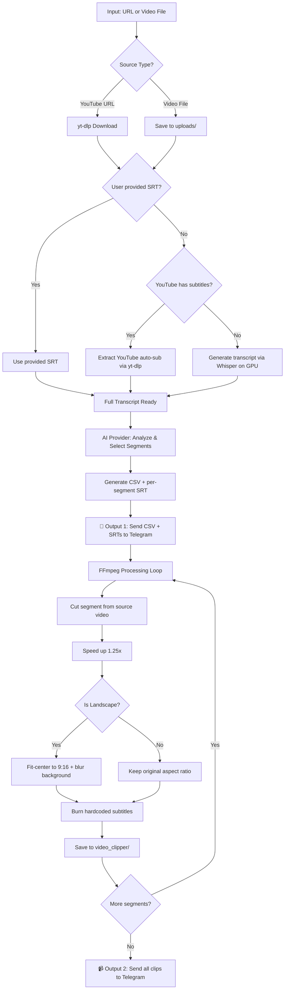

# PRD: SushiVideo

> *"Cut the best piece. Serve it in one bite."*

## 1. The Story (The Pain)

Content creators repurpose long-form YouTube videos into short-form clips (TikTok, Reels, Shorts) daily. The current pain points:

- **SaaS tools are expensive.** Opus Clip, Vizard, Munch — all charge $15-50/month for automated clipping. Solo creators in emerging markets can't justify this cost.
- **Local tools require hardware.** Running FFmpeg + AI analysis locally demands a powerful GPU, fast internet for downloading large videos, and sufficient storage. Most solo creators use laptops without dedicated GPUs.
- **Manual workflow is tedious.** Watch a 1-hour video, mentally note timestamps, manually edit in Premiere/CapCut, add subtitles, reformat to portrait — this takes 2-4 hours per video.
- **No validation step.** Most automated clippers go straight from AI selection to final output. If the AI picks bad segments, you waste compute and time re-running the entire pipeline.

**What happens if we DON'T build SushiVideo?** Creators continue paying for SaaS tools or spending hours on manual editing. Those without powerful PCs are locked out of AI-powered clipping entirely.

## 2. Competitive Edge

> "A little bit different > a little bit better."

| Competitor | Their Model | SushiVideo Difference |
|:---|:---|:---|
| **Opus Clip** | Cloud SaaS, $15-49/mo, proprietary AI | **Free.** Runs on Colab's free GPU. User owns the code. |
| **Vizard.ai** | Browser-based, team plans, $20+/mo | **Portable.** No account, no subscription. One Colab cell. |
| **Munch** | SEO-focused, enterprise pricing | **Simple.** No SEO scoring, no social scheduling. Just cuts. |
| **yt-dlp scripts** | Manual CLI, no AI segment selection | **Intelligent.** Gemini AI selects the best segments automatically. |
| **CapCut/Premiere** | Manual editing software | **Automated.** Zero manual editing. Input URL → Output clips. |

### SushiVideo's Unfair Advantage: Borrowed Infrastructure

Every competitor either (a) charges you for their cloud compute or (b) demands your local hardware. SushiVideo **borrows Google Colab's infrastructure** — GPU, bandwidth, and storage — for free. This makes it:

1. **Zero-cost** — No subscription, no GPU required locally.
2. **Extremely portable** — Works from any device that can open a browser.
3. **Fast** — Colab's network downloads YouTube videos at server-speed, not your home ISP speed.

## 3. Core Features

> Elite USPs only. NO CAPES!

### CF-1: AI Segment Selection (The Sushi Chef)

The "brain" of SushiVideo. Given a video's transcript/subtitle, an **AI provider** analyzes content and selects the 3-5 most engaging segments suitable for short-form content.

- **Input:** Full transcript/SRT of the video (text only — no media files sent to the AI).
- **Process:** Provider-agnostic prompt engineered to identify viral-worthy moments (hooks, punchlines, key insights, emotional peaks, controversial takes).
- **Output:** Structured CSV (`index, start, end, title, reason, caption`) + per-segment SRT files.

> **Architecture Note:** The AI provider is abstracted behind a `SegmentSelector` interface. Default: Gemini. Swappable to OpenAI, Claude, or any LLM without touching pipeline code. This protects against future pricing changes.

### CF-1b: Whisper Transcription Engine

When no user-provided SRT or YouTube auto-subtitles are available, **Faster-Whisper** (running on Colab GPU) generates the transcript locally. Gemini **cannot** process large video/audio files — Whisper handles all media-to-text conversion.

- **Input:** Local video/audio file.
- **Process:** Faster-Whisper (`large-v2`, CUDA, float16) with VAD filtering.
- **Output:** Timestamped SRT file.

### CF-2: Automated Video Editing Pipeline

FFmpeg-based automated editing that transforms raw segments into platform-ready short clips.

- **Speed adjustment:** 1.25x playback speed (proven engagement booster for short-form).
- **Portrait reformat:** Landscape → portrait (9:16) using fit-center (no zoom, no crop). Background filled with a blurred frame from the video itself.
- **Hard subtitles:** Burned-in subtitles with high-readability styling (large font, outline/shadow, bottom-center positioning).

### CF-3: Two-Phase Output with Human Validation

Unlike competitors that go straight to final output, SushiVideo splits the pipeline into two checkpoints:

- **Output 1 (Validation):** CSV + SRT files sent to Telegram immediately. User can review segment choices before committing to expensive video processing.
- **Output 2 (Final Clips):** Edited portrait shorts with hardsubs, delivered to Telegram and saved to `video_clipper/` folder.

### CF-4: Dual Input Channels

- **Telegram Bot:** Quick workflow — paste a YouTube URL + optional SRT file. Best for URLs and small files.
- **Gradio Web UI:** Heavy workflow — upload large video files directly, or provide URL + optional SRT. Handles files beyond Telegram's 20MB limit. Accessible via Colab's share URL.

## 4. Base Features (CRUD)

### BF-1: Video Acquisition
| Field | Type | Description |
|:---|:---|:---|
| `source_url` | `string` | YouTube URL (validated) |
| `source_file` | `file` | Direct video upload via Gradio |
| `subtitle_file` | `file` (optional) | User-provided `.srt` file |
| `video_local_path` | `string` | Local path after download |
| `video_duration` | `float` | Duration in seconds |
| `video_resolution` | `string` | e.g., `1920x1080` |
| `is_landscape` | `bool` | Width > Height |

### BF-2: Transcript/Subtitle Handling
| Field | Type | Description |
|:---|:---|:---|
| `transcript_source` | `enum` | `user_srt`, `youtube_auto`, `whisper_generated` |
| `transcript_text` | `string` | Full text content |
| `srt_content` | `string` | Timestamped SRT format |

### BF-3: Segment Data Model
| Field | Type | Description |
|:---|:---|:---|
| `index` | `int` | Segment number (1-based) |
| `start` | `string` | Start timestamp `HH:MM:SS.mmm` |
| `end` | `string` | End timestamp `HH:MM:SS.mmm` |
| `title` | `string` | Short descriptive title for the clip |
| `reason` | `string` | Why the AI selected this segment |
| `caption` | `string` | Social media caption suggestion |

### BF-4: Job State
| Field | Type | Description |
|:---|:---|:---|
| `job_id` | `string` | Unique identifier (8-char hex) |
| `status` | `enum` | `queued`, `downloading`, `analyzing`, `editing`, `delivering`, `completed`, `failed`, `cancelled` |
| `phase` | `enum` | `phase_1` (analysis), `phase_2` (editing) |
| `chat_id` | `int` | Telegram chat for delivery |
| `created_at` | `float` | Timestamp |

### BF-5: Configuration
| Field | Type | Default | Description |
|:---|:---|:---|:---|
| `SV_TELEGRAM_BOT_TOKEN` | `secret` | — | Bot token from BotFather |
| `SV_TELEGRAM_CHAT_ID` | `secret` | — | Admin chat ID |
| `AI_PROVIDER` | `enum` | `gemini` | Segment selection AI provider (`gemini`, `openai`, `anthropic`) |
| `SV_AI_API_KEY` | `secret` | — | API key for the selected AI provider |
| `AI_MODEL` | `string` | `gemini-2.5-flash` | Model name for the selected provider |
| `WHISPER_MODEL` | `string` | `large-v2` | Faster-Whisper model size |
| `SPEED_FACTOR` | `float` | `1.25` | Playback speed multiplier |
| `MAX_SEGMENTS` | `int` | `5` | Max segments to select |
| `MIN_SEGMENT_DURATION` | `int` | `15` | Minimum clip duration (seconds) |
| `MAX_SEGMENT_DURATION` | `int` | `60` | Maximum clip duration (seconds) |
| `SUBTITLE_FONT_SIZE` | `int` | `24` | Hardsub font size |
| `OUTPUT_FOLDER` | `string` | `video_clipper` | Output directory |
| `IDLE_SHUTDOWN_MINUTES` | `int` | `10` | Colab auto-shutdown timer |

## 5. User Flow

### Flow A: Telegram Input

### Flow B: Gradio Input

### Detailed Processing Pipeline

## 6. Non-Functional Requirements

### Performance
- **Download speed:** Leverage Colab's server-grade bandwidth (~100+ Mbps).
- **Processing time:** A 1-hour video should produce 3-5 clips within a single Colab session.
- **Memory management:** Clean up downloaded videos and intermediate files after processing to avoid Colab disk exhaustion.

### Reliability
- **Graceful degradation:** If Gemini API fails, log error and notify via Telegram. Do not crash.
- **Job queue:** Sequential processing via `asyncio.Queue` (pattern from TTB). One job at a time.
- **Idle monitor:** Auto-shutdown Colab runtime after configurable idle period to prevent wasting GPU credits.
- **Transient error handling:** Network errors during download/upload should retry, not crash (pattern from TTB).

### Security
- **Secrets management:** All API keys via Colab Secrets (`userdata.get()`), never hardcoded.
- **Chat filtering:** Telegram bot responds only to `TELEGRAM_CHAT_ID` (pattern from TTB).
- **No persistent storage:** All files are ephemeral within Colab session. Nothing persists after runtime disconnect.

### Compatibility
- **Runtime:** Google Colab GPU only (T4 default). No CPU fallback.
- **Python:** 3.10+ (Colab default).
- **FFmpeg:** Pre-installed in Colab. No additional setup needed.

## 7. Success Criteria

| # | Criterion | Pass/Fail |
|:---|:---|:---|
| SC-1 | Given a 1-hour YouTube video URL, SushiVideo downloads the video successfully on Colab | Binary |
| SC-2 | Transcript is obtained (from user SRT, YouTube auto-sub, or Whisper generation) | Binary |
| SC-3 | AI Provider selects 3-5 segments and generates valid CSV + SRT output | Binary |
| SC-4 | CSV + SRT files are delivered to Telegram (Output 1) | Binary |
| SC-5 | FFmpeg produces portrait (9:16) clips at 1.25x speed with hardcoded subtitles | Binary |
| SC-6 | All edited clips are delivered to Telegram (Output 2) | Binary |
| SC-7 | Gradio UI accepts video file upload and URL input | Binary |
| SC-8 | Bot auto-shuts down Colab runtime after idle timeout | Binary |
| SC-9 | Entire pipeline runs within a single Colab GPU session without crash | Binary |
