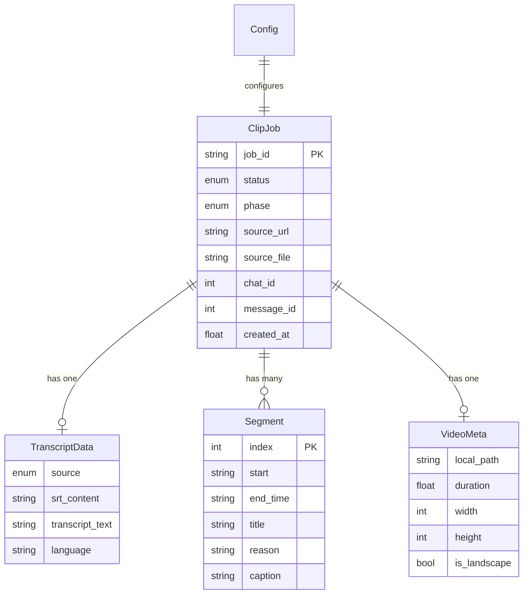
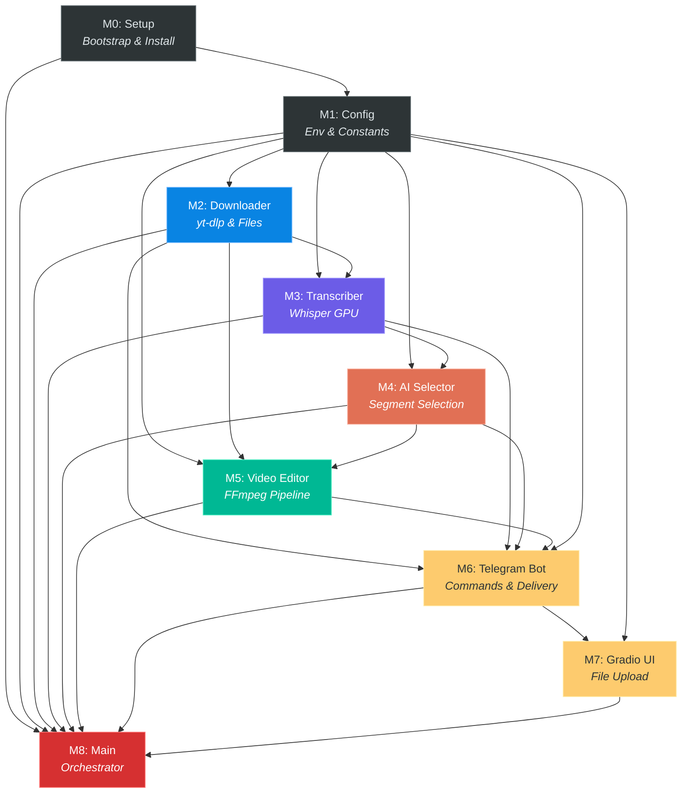

# Modules: SushiVideo

## 1. Global Tech Stack

| Category | Technology | Version | Purpose |
|:---|:---|:---|:---|
| **Language** | Python | 3.10+ | Colab default runtime |
| **Runtime** | Google Colab | — | GPU compute, bandwidth, storage |
| **Bot Framework** | python-telegram-bot | 21.x | Telegram bot with async polling |
| **Web UI** | Gradio | 4.x | File upload interface for large videos |
| **Video Download** | yt-dlp | 2024.x+ | YouTube video + subtitle download |
| **Video Processing** | FFmpeg (CLI) | 6.x+ | Cutting, reformat, speed, hardsub |
| **FFmpeg Wrapper** | ffmpeg-python | 0.2.x | Python bindings for FFmpeg probe |
| **Transcription** | faster-whisper | 1.1.x | Local GPU speech-to-text (CTranslate2) |
| **AI (Default)** | google-genai | 1.x | Gemini API for segment selection |
| **Async** | nest_asyncio | 1.x | Nested event loop (Colab compat) |
| **Async** | asyncio (stdlib) | — | Queue, tasks, concurrency |

### Pinned Dependencies (`requirements.txt`)
```
python-telegram-bot>=21.0
yt-dlp
ffmpeg-python
faster-whisper>=1.1.0
google-genai>=1.0.0
gradio>=4.0.0
nest_asyncio
```

## 2. Global Data Model

| Entity | Key Fields | Relationships | Storage |
|:---|:---|:---|:---|
| **ClipJob** | `job_id`, `status`, `phase`, `source_url`, `source_file`, `chat_id`, `message_id`, `created_at` | Has one `TranscriptData`, has many `Segment` | In-memory (dataclass) |
| **TranscriptData** | `source` (enum), `srt_content`, `transcript_text`, `language` | Belongs to `ClipJob` | In-memory + temp file |
| **Segment** | `index`, `start`, `end`, `title`, `reason`, `caption` | Belongs to `ClipJob` | CSV file + in-memory |
| **VideoMeta** | `local_path`, `duration`, `width`, `height`, `is_landscape` | Belongs to `ClipJob` | In-memory (from ffprobe) |
| **Config** | All env vars from BF-5 | Global singleton | Environment variables |

### Entity Relationship Diagram



## 3. Module Orchestration

| # | Module | Description | Depends On |
|:---|:---|:---|:---|
| 0 | **Setup** | Colab bootstrap, dependency install, secrets, config, folder structure | — |
| 1 | **Config** | Environment config class, AI provider registry, constants | M0 |
| 2 | **Downloader** | YouTube download (yt-dlp) + subtitle extraction + video file handling | M0, M1 |
| 3 | **Transcriber** | Whisper transcription engine, SRT generation, subtitle fallback chain | M0, M1, M2 |
| 4 | **AI Selector** | Provider-agnostic segment selection, CSV/SRT output generation | M1, M3 |
| 5 | **Video Editor** | FFmpeg pipeline: cut, speed, portrait reformat, blur bg, hardsub | M1, M2, M4 |
| 6 | **Telegram Bot** | Bot commands, message handling, file delivery, idle monitor, job queue | M1, M2, M3, M4, M5 |
| 7 | **Gradio UI** | Web interface for file upload and URL input | M1, M6 |
| 8 | **Main Orchestrator** | Entry point, startup sequence, background task coordination | All |

## 4. Dependency Graph



## 5. Risk Chains

### RC-1: YouTube Download Failure
```
yt-dlp fails (geo-block, age-gate, rate limit)
  → No video file available
    → Entire pipeline blocked
      → Job fails, user notified via Telegram
```
**Mitigation:** yt-dlp supports cookies, proxy, and multiple format fallbacks. Log detailed error. Notify user with actionable message (e.g., "Try uploading the video directly via Gradio").

### RC-2: Subtitle Unavailability Chain
```
No user SRT provided
  → No YouTube auto-subtitles available
    → Whisper transcription required (GPU-intensive)
      → If Whisper model fails to load → No transcript → Pipeline blocked
```
**Mitigation:** This is the longest chain. Whisper is loaded during startup (background init, pattern from TTB). If Whisper fails, notify user to provide SRT manually or use a video with YouTube subtitles.

### RC-3: AI Provider Failure
```
AI API call fails (rate limit, quota, network)
  → No segment selection
    → Pipeline blocked at Phase 1
      → No Output 1 or Output 2
```
**Mitigation:** Implement retry with exponential backoff. Support fallback model within the same provider (e.g., `gemini-2.5-flash` → `gemini-2.0-flash`). Provider abstraction allows switching entirely.

### RC-4: FFmpeg Processing Failure
```
FFmpeg filter chain fails (corrupt video, unsupported codec)
  → One or more clips not generated
    → Partial Output 2
```
**Mitigation:** Process each segment independently. If one segment fails, skip it, log error, and continue with remaining segments. Send partial results + error report.

### RC-5: Telegram File Size Limit
```
Edited clip exceeds 50MB (Telegram bot API limit)
  → Cannot send via Telegram
    → Output 2 delivery fails
```
**Mitigation:** Monitor output file size. If exceeding limit, compress with lower CRF or split. Always save to `video_clipper/` folder as backup — user can download from Colab Files panel or mounted Google Drive.

### RC-6: Colab Session Timeout
```
Colab session disconnects mid-processing
  → All in-memory state lost
    → Partial/no output delivered
```
**Mitigation:** Send Output 1 (CSV + SRT) to Telegram as early as possible (before video editing). This ensures the user at least has the segment data even if the session dies during FFmpeg processing. Idle monitor prevents unnecessary GPU usage.
